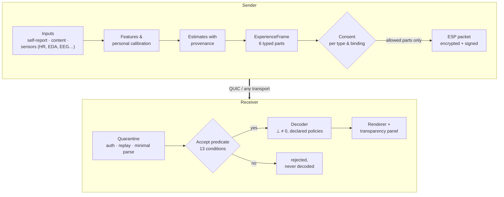
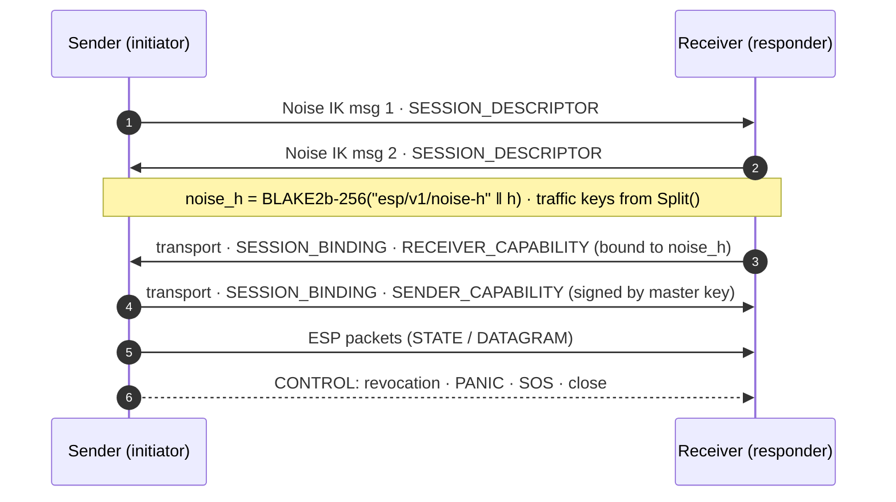

<p align="center">
  
</p>

<p align="center">
  <a href="LICENSE"></a>
  <a href="docs/LICENSING.md"></a>
  <a href="docs/LICENSING.md"></a>
  
  
  
</p>

# Experience Semantic Protocol (ESP) — Reference Implementation

**ESP moves _typed_, _consent-bound_ representations of experience between people and machines,
instead of forcing everything through words.** This repository is the open reference
implementation of the ESP V13 specification and its six-part representation, **TAOSS**. It
covers the wire format, cryptography, consent, sessions, transports, privacy,
sensor adapters and benchmarks.

> *Even imperfect experience transfer changes what communication can be.*
> — ESP V13, Damir Đulović, 2026

**Contents:**
[For everyone](#1-for-everyone-what-is-this) ·
[Try it](#2-try-it-in-five-minutes) ·
[How it works](#3-how-it-works-step-by-step) ·
[What works today](#4-what-works-today) ·
[Test results](#5-test-results) ·
[Technical deep dive](#6-technical-deep-dive) ·
[Honesty](#7-what-esp-does-not-do) ·
[Repository map](#8-repository-map) ·
[License & citation](#9-license-attribution-citation) ·
[Deutsch](#10-kurz-auf-deutsch)

---

## 1. For everyone: what is this?

### The problem with words

When you say *"I'm worried about my job"*, the listener has to rebuild what you mean from their
own experience. Language carries only a few dozen bits per second. It works because every word
points into a huge *shared prior*: culture, vocabulary, common history. When two people share
that prior, a few words are enough. When they don't (different cultures, professions, ages, or a
person and a machine), much of the meaning is lost.

The ESP paper puts it like this:

> Human communication is not bandwidth-limited in the way we usually say it is. Language
> transmits roughly 50 bits per second, but each token is a pointer into a shared semantic prior
> — culture, lexicon, common ground. […] This makes language efficient when priors align […]
> and catastrophically lossy when they do not.

### The idea: send the structure of an experience, in labelled parts

ESP describes a moment of experience with **six separate, labelled parts** instead of sentences:

<p align="center"></p>

| Part | Short | Plain meaning | Example for "I'm worried about my job" |
|---|---|---|---|
| Knowledge | **KNO** | what it is about | "possible dismissal" |
| Intention | **INT** | what the person wants or is ready to do | "avoid the topic", "ask for a meeting" |
| Emotion | **EMO** | how it feels | fear 0.75, sadness 0.4, valence −0.6 |
| Context | **CTX** | the situation | at work, in a meeting |
| Sensory | **SEN** | sensory qualities | the noise of the office |
| Temporal | **TEM** | timing and rhythm | building up over weeks |

Each part is a list of numbers (a *latent vector*) produced by an encoder. Together they have 512
numbers. Human-readable descriptions can travel with them: anchors like "fear", self-reports,
and relations like "emotion → *elicited by* → knowledge".

### Why the parts matter: consent per part

Because the parts are separate, **you can share some and keep others**. It works much like app
permissions on a phone:

- Share *what* and *why* (KNO, INT, CTX) with a colleague, but **not how you feel** (EMO).
- Share how you feel with a therapist, but not the context.
- Change your mind later: **revoke**, and the receiver must reject anything more.

This is enforced by cryptography, not by a checkbox:

- A withheld part is **not in the message at all**. It is not encrypted-and-hidden; the numbers
  are simply never sent.
- Consent is a **signed, time-limited, revocable capability**. The receiver must also consent to
  *receive*. Nothing flows unless both sides agree.
- Every piece of data carries **provenance**: who or what produced it, and whether it is
  content-side, self-declared or inferred.

### A tiny story

> Anna uses an ESP app. She describes her day with sliders (worry 4/5, wants to avoid the topic,
> at work). Her capability for her colleague Ben allows KNO, INT and CTX, but not EMO. Ben's
> screen shows: *topic: possible dismissal · wants to avoid it · at work*, and a transparency
> panel: *emotion: withheld by the sender*. Later Anna grants EMO to her coach in a new session.
> The coach sees "fear, elicited by possible dismissal". When Anna revokes that grant, the coach's
> software refuses everything that follows.

This exact sequence runs as an automated test with two separate programs talking over the
network ([M5 gate](tests/milestone/test_m5.py)).

### Is this mind reading? No.

ESP is a **protocol**, like HTTPS is for web pages. It defines how typed, consented
representations are packaged, protected and checked. It does **not** read minds, transfer
consciousness or reliably detect emotions. Today's inputs are *structured self-reports*,
*content* (films, texts) and *measured signals* such as heart rate. Brain interfaces are a
long-term horizon with interfaces only (see [§7](#7-what-esp-does-not-do)).

---

## 2. Try it in five minutes

```bash
git clone https://github.com/Vigilant-CRS/Experience-Semantic-Protocol_TAOSS.git
cd Experience-Semantic-Protocol_TAOSS
uv sync                      # Python 3.12, installs everything incl. dev tools

# Interactive consent inspector in your browser (local only, 127.0.0.1)
uv run esp-demo ui --port 8080
# -> open http://127.0.0.1:8080, move sliders, switch consent per type, press "Send one frame"
```

Every click runs a **real exchange**:

1. a fresh Noise IK handshake;
2. signed capabilities on both sides;
3. an encrypted, signed packet;
4. a quarantined receive;
5. audited decoders.

The page shows the cleartext header, the encrypted size, which data objects were actually inside
after decryption ("EMO in plaintext: no"), what the receiver got, and what it *cannot* reconstruct.

Run the demo as two independent programs over QUIC:

```bash
D=/tmp/esp-demo
uv run esp-demo init $D/keys                                        # keys + certificate
uv run esp-demo receive $D/keys --port 4433 --events $D/recv.jsonl &
uv run esp-demo send $D/keys --port 4433 --capture $D/send.jsonl    # the 11-step M5 script
uv run esp-demo inspect --events $D/recv.jsonl --capture $D/send.jsonl --out $D/inspector.html
```

Full verification (lint, types, licenses, plan sync, schemas, vectors, 600+ tests):

```bash
make verify
uv run python scripts/run_milestone.py M5   # writes artifacts/test-reports/M5.json
uv run python scripts/fetch_datasets.py     # optional: open PhysioNet / MNE / XDF test data
```

---

## 3. How it works, step by step



1. **Inputs → features.** Signals are turned into neutral *features* such as heart rate, heart-rate
   variability, skin conductance, respiration rate, pupil size or EEG band power. They are
   normalized against the person's own baseline. A feature is not an emotion.
2. **Estimates with provenance.** Estimators produce *claims* ("activation high, confidence 0.6,
   from ECG, calibration profile X"). Self-reports are never overwritten. Conflicts between sources
   are reported, not averaged away.
3. **Experience frame.** The claims and the encoder's latents form one frame with six typed blocks,
   optional anchors, affect descriptors, intentions and bindings.
4. **Consent.** The sender's capability, the receiver's capability and the session profile are
   intersected. Everything outside the intersection is removed from the payload.
5. **Packet.** A 100-byte header, the encrypted payload, an authentication tag and an Ed25519
   signature.
6. **Receiver quarantine.** The receiver checks authenticity, replay, sizes and a minimal parse
   *before* it looks at any meaning. The frame decoder only runs if all 13 acceptance
   conditions hold.
7. **Decoding and display.** Absent parts stay absent (`⊥`), never silently zero. A transparency
   panel shows what arrived, what was masked, and what cannot be reconstructed.

---

## 4. What works today

Work is organized in work packages (WP) and milestones (M). A milestone is **PASS** only when its
gate tests and the full suite pass on a clean, committed tree. The machine-written evidence is
in [`artifacts/test-reports/`](artifacts/test-reports/) and
[`docs/IMPLEMENTATION_STATUS.md`](docs/IMPLEMENTATION_STATUS.md).

| Milestone | Content | Status |
|---|---|---|
| M0 | Repository, licensing (REUSE), DCO, CI, plan-sync checks | ✅ PASS |
| M1 | Data model: observations, evidence, affect with `affect_scope`, frames, ontology registry | ✅ PASS |
| M2 | Deterministic simulator, oracle/rule-based estimators, fusion without hiding conflicts | ✅ PASS |
| M3 | Wire format V13: header, TLVs, typed latents, Noise IK, AEAD, signatures, capabilities, Accept, revocation, sessions, golden vectors, fuzzing | ✅ PASS |
| M3a | Key lifecycle (rotation, compromise, transparency log with witnesses, Shamir custody), runtime differential privacy with persistent ledger | ✅ PASS |
| M4 | QUIC transport, impaired-network grid, migration, reconnect, SF profiles, turn tokens/SOS/PANIC, **metadata protection** | ✅ PASS |
| M5 | BCI-free demo (two processes), decoder layer, receiver threats T13–T19, **EU AI Act Art. 5(1)(f) guard**, interactive inspector | ✅ PASS |
| M6 | Physiology without hardware: BrainFlow, LSL, XDF/EDF/BDF/BrainVision/WFDB/Empatica readers, features, calibration, 30-min soak | 🔄 gate re-run |
| M7–M10 | Multimodal estimation (L2-gated), trainable TAOSS encoder, leakage & audit suite, ExperienceBench, independent Rust implementation | 🛠 in progress |
| M11–M17 | Performance & security candidate, release 1.0, machine & agent governance, experience capsules (XCF), Typed Hive, horizon interfaces | 📋 planned |

---

## 5. Test results

The full suite has more than 600 automated tests: unit, property-based (Hypothesis), conformance
vectors, fuzzing (1 million inputs locally), integration over real QUIC, and milestone gates.
Security rules are **mutation-checked**: each rule is deliberately broken once, and a test must
fail.

### Network robustness (M4 gate)

ESP was run over an impaired network for every combination of 0/200 ms latency, 0/50 ms jitter,
0/10 % loss, on reliable streams and on unreliable datagrams:

| Condition | Channel | p50 latency | p99 latency | Frames lost | Revoked data accepted |
|---|---|---:|---:|---:|---:|
| ideal | STATE | 30 ms | 44 ms | 0 % | **0** |
| 200 ms, ±50 ms jitter, 10 % loss | STATE | 1383 ms | 1447 ms | 0 % | **0** |
| ideal | DATAGRAM | 29 ms | 43 ms | 0 % | **0** |
| 200 ms, ±50 ms jitter, 10 % loss | DATAGRAM | 211 ms | 251 ms | 12.5 % | **0** |

The pattern is expected. Reliable streams deliver everything but suffer head-of-line delay under
loss; datagrams stay fresh but drop frames. In every one of the 16 conditions, **nothing was
accepted after a revocation**, and PANIC/SOS always arrived. QUIC connection migration (NAT
rebinding) keeps the ESP session alive. A reconnect is a fresh handshake, while budgets and
revocations survive it.

### Consent demo with two processes (M5 gate)

Sender and receiver run as separate programs over QUIC:

- **EMO withheld:** the header bit is clear, `EMO_MASKED` is set, and **no EMO object is in the
  decrypted payload**.
- **EMO granted** in a new session: EMO appears, and the binding "EMO *elicited by* KNO" can be
  masked on its own.
- **After revocation:** the sender stops itself, and the receiver refuses the revoked capability
  in any new session.
- The frame decoder ran only for accepted frames.

### Physiology on real, open data (M6)

- The EDF reader matches `pyedflib` exactly on PhysioNet EEG (values and annotations).
- Heart rate computed from the Empatica pulse signal agrees with the device's own heart rate
  (median deviation < 8 bpm).
- 30-minute soak (BrainFlow synthetic board → Lab Streaming Layer → receiver, plus an event
  stream and sliding-window EEG features):

| Metric | Result |
|---|---|
| duration | 1801 s |
| samples sent → received | 449,933 → 449,933 (**0 lost**) |
| dropped samples (package counter) | **0** |
| timestamp order violations | **0** |
| events sent → received in order | all |

The formal M6 verdict is being re-run: one bound in the test itself was off by one (178 of 179
possible 10-s feature windows).

Open datasets are downloaded by [`scripts/fetch_datasets.py`](scripts/fetch_datasets.py) into a
git-ignored folder with license and checksum manifests. They are never committed. See
[`datasets/registry.json`](datasets/registry.json).

---

## 6. Technical deep dive

### 6.1 The packet

<p align="center"></p>

- **Header (100 B, big-endian):** magic `ESP`, version, profile (L1 = 1), SF level 0–7, 16-bit
  types bitmap, consent flags (`EMO_MASKED`, `NO_REPLAY`, `NO_STORE`), privacy flags
  (DP level, `QUANTIZED`, `TIMING_OBF`), timestamp, timeline UUIDv4, sequence, `dt_ms`, phase,
  per-session sender key, `payload_len`, nonce. Decoding is strict: every accepted header
  re-encodes to the same bytes.
- **Payload:** TLVs `code u8 · len u32 · value`. Typed latents `0x60–0x65` in F32, F16 or INT8
  (symmetric quantization). Anchor coordinates `0x50`. The addendum profile `esp-addendum-v1`
  (`0x80–0x9F`) carries descriptors, affect with `affect_scope`, intentions, bindings, frame
  metadata, SOS and metadata-protection markers.
- **Type-presence invariant:** a types bit is set if and only if an object of that type is present,
  so an EMO descriptor cannot be smuggled past `EMO_MASKED`.
- **Crypto:** ChaCha20-Poly1305 with the header as associated data. Deterministic nonces
  `timeline_tag(8) ‖ seq(4)` derived with BLAKE2b (ADR-0009). Ed25519 over
  header ‖ ciphertext ‖ tag. Retransmissions are byte-identical.

### 6.2 Session establishment



Profiles are negotiated and never silently upgraded or downgraded: profile, SF level, nonce
mode, PQ mode and DP level must match, and pinned registries must carry identical digests.
Capabilities travel only at establishment. Granting more rights therefore needs a new handshake,
while withdrawing works at any time.

### 6.3 The acceptance predicate (receiver side)

A packet is accepted only if **all** hold:

1. it is authentic;
2. a verified sender capability and a valid receiver policy exist (**default deny**);
3. its types ⊆ sender-allowed ∩ receiver-accepted;
4. the receiver is in the audience;
5. the segment budget is not exhausted;
6. the sender capability is still valid;
7. the receiver capability is valid;
8. the DP ε-ceiling is respected;
9. no-replay/no-store flags match the rights;
10. the norm cap per type holds;
11. valence lies within the receiver's bounds;
12. the rate limit holds;
13. the capability is not revoked.

`evaluate()` reports every violated condition; nothing is decoded before acceptance.

### 6.4 Privacy and security layers

| Layer | What it does | Where |
|---|---|---|
| Consent capabilities | signed, expiring, audience-bound; receiver consents to receive | `src/esp/consent/` |
| Revocation & deletion | lineage-aware withdrawal, deletion requests + attestations | `consent/revocation.py` |
| Key lifecycle | rotation binding, compromise with fail-closed grants, RFC 9162 transparency log + witnesses, Shamir custody | `src/esp/keys/` |
| Runtime DP | clip + Gaussian noise, RDP accountant, persistent ledger charged *before* release, receiver audit | `src/esp/privacy/dp.py` |
| Metadata protection | constant type bitmap with dummy latents, size padding, decoys at constant rate, `TIMING_OBF` (ADR-0027) | `privacy/metadata.py` |
| Receiver threats | NaN/Inf/norm/valence pre-screens, decode budgets, decoder drift archive, mandatory vendor provenance, anchor-only mode | `session/endpoint.py`, `decoder/` |
| Regulation | mandatory declaration, EU AI Act Art. 5(1)(f) guard, Annex III high-risk, runtime `affect_scope` enforcement | `src/esp/regulatory/`, [REGULATORY.md](docs/REGULATORY.md) |
| Decoder honesty | absent `⊥` ≠ zero vector, declared per-type policy, audit against silent ⊥→0 | `src/esp/decoder/` |

### 6.5 Affect scope: content is not a person

Every affect statement says what it is about:

- `content`: what a film expresses;
- `self_declared`: a person's own report;
- `inferred_subject`: a model's inference about a person;
- `machine_relay`: a machine passing on a human statement.

Inferred subject affect requires profile L2, explicit L2 consent, and a regulatory declaration.
The pipeline refuses to start for emotion recognition from biometrics at work or school
(EU AI Act Art. 5(1)(f)). This is not legal advice; see [REGULATORY.md](docs/REGULATORY.md).

### 6.6 Sensors without hardware

- **BrainFlow:** synthetic, playback-file and multicast streaming boards.
- **Lab Streaming Layer:** outlets and inlets with explicit clock-correction metadata, a
  BrainFlow→LSL bridge, and replay.
- **Recording readers:** EDF/EDF+/BDF (own implementation), BrainVision, Empatica E4, WFDB, XDF.
- **Deterministic replay** with content digests.
- **Features** (numpy only, with quality scores):
  - heart rate from ECG or PPG, HRV (SDNN/RMSSD/pNN50);
  - EDA tonic level and responses;
  - respiration rate;
  - pupil and gaze;
  - EEG band power.
- **Personal calibration:** device correction, then robust z-score or a person-specific probit.

### 6.7 Conformance

Golden vectors in [`vectors/`](vectors/) (CC BY 4.0) cover:

- headers, latents and malformed inputs;
- packets, sessions and capabilities;
- revocation and identity bindings;
- replay windows and DP accounting.

An independent Rust implementation (`rust/esp-rs`, M10) is checked against the same vectors
and live against the Python peer.

### 6.8 Decisions and gaps

Design decisions are recorded as ADRs in [`docs/decisions/`](docs/decisions/). Places where
V13 is ambiguous are tracked as numbered gaps (GAP-001…) in the
[master plan](docs/MASTER_IMPLEMENTATION_PLAN.md) §52b and fed back as errata.

---

## 7. What ESP does not do

- It does **not** read minds, transfer consciousness or "detect emotions" reliably.
- It makes **no** claim that the typed parts are semantically independent. Leakage between parts
  is *measured* (mutual information, probes, predictive V-information), not assumed.
- H1–H3 (consent granularity, leakage reduction, downstream benefit) are **falsifiable
  hypotheses**. Smoke benchmarks are labelled *exploratory*. A run only counts as evidence with a
  preregistration, all required baselines, split discipline and multiplicity correction.
- Human studies need ethics approval. They are never simulated as evidence.
- Brain interfaces, the Machine Experience Bridge beyond simulation, and the Typed Hive are
  research tracks with interfaces and simulators, not product claims.

Claims are graded on the claims ladder in the master plan (§59).

---

## 8. Repository map

```text
src/esp/
  core/ observation/ evidence/ semantics/   data model, affect scope, provenance
  frame/ taoss/ ontology/                   ExperienceFrame, typed blocks, anchor registry
  codec/ crypto/ consent/ keys/ privacy/    wire format, Noise/AEAD/Ed25519, capabilities, DP
  session/ transport/                       endpoints, profiles, QUIC, memory, netem, overlay
  decoder/ regulatory/                      decoder layer, EU guard
  adapters/physio/ features/ calibration/   BrainFlow, LSL, file readers, features, baselines
  estimators/ simulation/ demo/             estimators, simulator, esp-demo CLI + UI
tests/      unit · property · conformance · fuzz · integration · milestone gates
vectors/    golden conformance vectors (CC BY 4.0)
docs/       master plan, status ledger, ADRs, regulatory mapping, licensing
scripts/    milestone runner, plan sync, schema/vector generators, dataset fetcher
```

---

## 9. License, attribution, citation

The core stays free, commercial use is allowed, and attribution is required.

- Code: **AGPL-3.0-or-later**. Network use counts: modified versions must offer their source.
- Specification, docs, ontology: **CC BY-SA 4.0**.
- Test vectors, schemas: **CC BY 4.0**.
- Names and the conformance mark: see [TRADEMARKS.md](TRADEMARKS.md).

Details: [docs/LICENSING.md](docs/LICENSING.md) · [NOTICE](NOTICE) ·
[CONTRIBUTING.md](CONTRIBUTING.md). Contributions need a DCO sign-off; there is no CLA.

The first L1 application is the
[Emotional Movie Search Engine](https://github.com/Vigilant-CRS/Experience-Semantic-Protocol_Emotional-Movie-Search-Engine).

```bibtex
@techreport{dulovic2026esp,
  author = {Đulović, Damir},
  title  = {The Experience Semantic Protocol: A North Star for Post-Linguistic Communication},
  year   = {2026},
  month  = sep,
  note   = {Version V13, Stuttgart},
  url    = {https://github.com/Vigilant-CRS/Experience-Semantic-Protocol_TAOSS}
}
```

---

## 10. Kurz auf Deutsch

**ESP überträgt Erfahrung in sechs beschrifteten Teilen statt in Sätzen.** Die Teile sind Wissen,
Absicht, Emotion, Kontext, Sinneseindruck und Zeit. Für jeden Teil entscheidest du einzeln, wer
ihn bekommt, ähnlich wie bei App-Berechtigungen. Die Zustimmung ist kryptografisch signiert,
zeitlich begrenzt und widerrufbar. Ein zurückgehaltener Teil ist gar nicht in der Nachricht,
nicht bloß verschlüsselt. Der Empfänger prüft 13 Bedingungen, bevor er den Inhalt überhaupt deutet.

ESP liest keine Gedanken und erkennt keine Gefühle zuverlässig. Heute arbeitet es mit
strukturierten Selbstauskünften, Inhalten und Messwerten wie Puls oder Hautleitwert.
Ausprobieren: `uv run esp-demo ui` und dann http://127.0.0.1:8080 öffnen.
