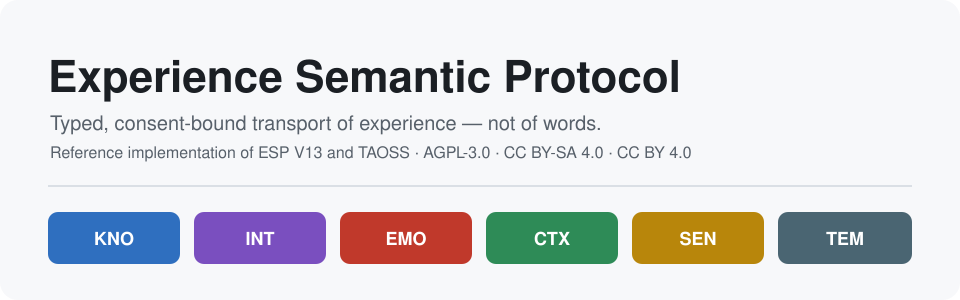
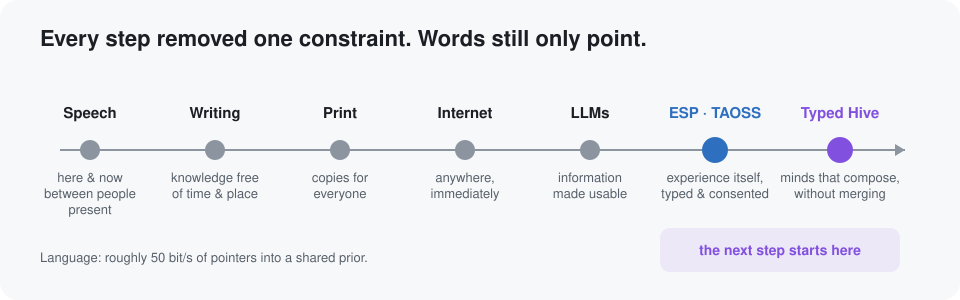
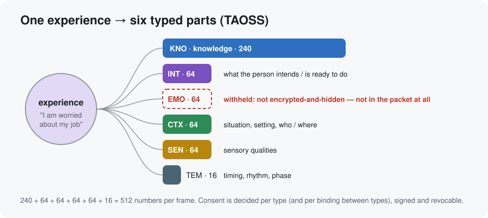
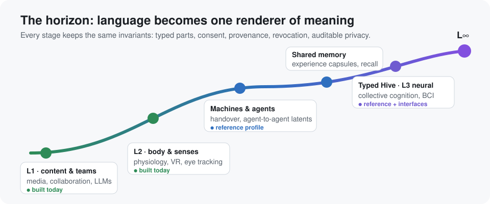
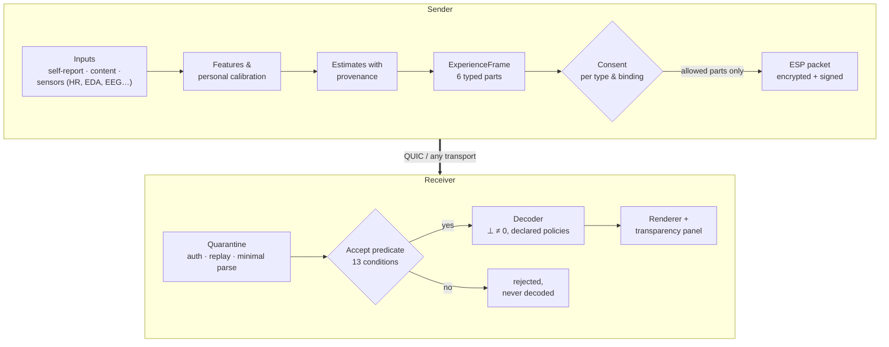
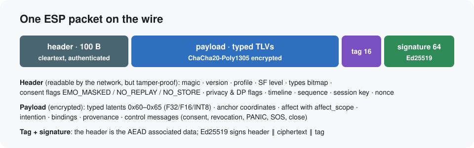
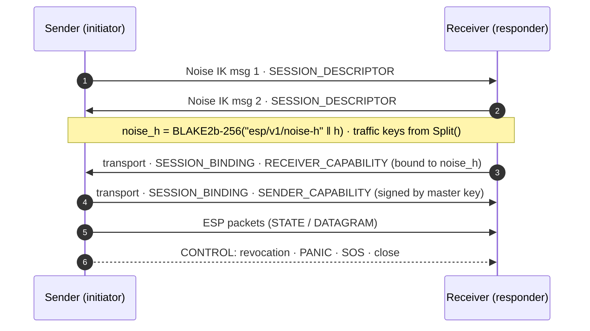

<p align="center">
  
</p>

<p align="center">
  <a href="LICENSE"></a>
  <a href="docs/LICENSING.md"></a>
  <a href="docs/LICENSING.md"></a>
  
  
  
  
</p>

# Experience Semantic Protocol (ESP)

### A North Star for post-linguistic communication, and the open reference implementation that makes it real.

**ESP lets people and machines exchange the _structure_ of an experience, not just the words
about it.** Knowledge, intention, emotion, context, sensation and time travel as six typed parts
(**TAOSS**). You decide, part by part, who may receive what. Language stays, but it becomes one
renderer of meaning among many instead of the only pipe it has to squeeze through.

This repository is the reference implementation of the ESP V13 specification. It covers the
wire format, cryptography and consent, transports, physiology adapters, trainable encoders,
leakage audits, an independent Rust implementation, persistent experience capsules, a Typed Hive
for collective cognition, and interfaces for machines, agents and neural devices.

> *This is not a finished system. It is a coordinate. It fixes a point in idea-space precise
> enough for others to orient toward it.*
> — The Experience Semantic Protocol, V13 (Damir Đulović, 2026)

**Contents:**
[The Adriatic Moment](#1-the-adriatic-moment) ·
[Evolution](#2-why-this-is-the-next-step) ·
[The idea](#3-the-idea-send-the-experience-not-a-pointer-to-it) ·
[What ESP is for](#4-what-esp-is-for) ·
[Try it](#5-try-it-in-five-minutes) ·
[How it works](#6-how-it-works-step-by-step) ·
[Built today](#7-built-today) ·
[Test results](#8-test-results) ·
[Deep dive](#9-technical-deep-dive) ·
[Invitation](#10-an-invitation) ·
[Evidence](#11-how-we-keep-it-honest) ·
[Repository](#12-repository-map) ·
[License & citation](#13-license-attribution-citation) ·
[Deutsch](#14-kurz-auf-deutsch)

---

## 1. The Adriatic Moment

> Stand on a limestone cliff above the Adriatic at evening. Pine resin and salt in the air. The
> sea has gone gold. You feel something specific: a cohabitation of serenity and melancholy
> that has a distinct shape, with edges, textures, a temporal contour.
>
> You text a friend: *"The sunset was beautiful."*
>
> Six words. They will never feel what you felt.

The six words do not contain the experience. They are **pointers** into a codebook the receiver
already carries: language, culture, memory, a body that has stood on cliffs. If your friend has
stood on a similar cliff, a lot arrives. If not, no amount of eloquence brings the missing prior
into their head.

So the bottleneck of human communication is not really speed. Language carries roughly 50 bits
per second and works brilliantly when the priors align: within a culture, a profession, a
friendship. It breaks down when they do not: across cultures, generations and disciplines, and
between people and machines.

**ESP's wager is to make part of that codebook explicit, trainable, interoperable and
consent-governed.**

---

## 2. Why this is the next step

<p align="center"></p>

| Step | What it made possible | What stayed the same |
|---|---|---|
| **Speech** | Meaning shared between people, here and now | Bound to the moment and to who is present |
| **Writing** | Knowledge free of time and place: it outlives its author and travels without the speaker | Experience flattened into symbols |
| **Print** | The same text for everyone, at scale | One-way, slow |
| **Internet** | Anyone, anywhere, immediately | A flood of text and media that the reader must interpret |
| **Language models** | Information made *usable*: summarized, answered, acted on. Machines start to talk beyond words, in hidden states | Between humans, still sentences as pointers into a prior |
| **ESP · TAOSS** | **Experience itself**: what someone knows, wants, feels, senses and when, as typed parts with consent per part | |
| **Typed Hive** | **Minds that compose without merging**: shared memory and collective cognition, auditable and revocable | |

Every step removed a constraint. Writing removed time and place, the internet removed distance
and delay, language models removed the work of making information usable. **What remains is the
prior itself.** Words still only point, and the receiver has to have what they point at. ESP
transmits what they point at.

---

## 3. The idea: send the experience, not a pointer to it

Instead of a sentence, ESP sends a moment of experience as **six labelled parts**. Each part is
a vector of numbers from a shared, auditable encoder, with optional human-readable anchors
("fear", "wants to avoid it", "at work") and relations between the parts.

<p align="center"></p>

| Part | Short | Carries | In the Adriatic Moment |
|---|---|---|---|
| Knowledge | **KNO** | what it is about | coast, sunset, a specific place |
| Intention | **INT** | what the person wants or is ready to do | to share it, to stay a little longer |
| Emotion | **EMO** | how it feels | serenity with melancholy, valence and arousal |
| Context | **CTX** | the situation | alone, evening, end of a journey |
| Sensory | **SEN** | sensory qualities | gold light, pine resin, salt, wave rhythm |
| Temporal | **TEM** | timing and rhythm | slow, fading, a closing arc |

This shifts communication from a *linguistic-prior-bound* regime (sparse, brittle, culturally
specific) to a *parametric-prior-bound* regime: the shared prior is an encoder that can be
**probed, retrained, compared and improved**.

### Consent is part of the grammar

Because the parts are separate, sharing becomes precise:

- Share **what and why** (KNO, INT, CTX) with a colleague, and **how it felt** only with the
  people you choose.
- Consent is a **signed, time-limited capability**. The receiver must consent to *receive*, and
  you can **revoke** at any time.
- A part you withhold is **not in the message at all**. It is not hidden or encrypted, it simply
  is never sent.
- Everything carries **provenance**: who or what produced it, and whether it describes content,
  the person's own statement, or an inference.

The governance layer arrives *before* human experience becomes payload. That is a design choice
of the protocol, not a later add-on.

---

## 4. What ESP is for

<p align="center"></p>

**Today (L1): content, teams, AI.**

- **Semantic media retrieval.** *"A film with the emotional architecture of Tokyo Story, but
  sci-fi."* The query is expressible in EMO + CTX + TEM, not in keywords. The first L1
  application is the Emotional Movie Search Engine (25k films).
- **Director's cut metadata.** A film ships an explicit intention, emotion and timing track that
  viewers can opt into.
- **Knowledge transfer with context.** A lecture transmits concepts (KNO) and the rhythm of the
  explanation (TEM), and it keeps the speaker's nervousness private.
- **Collaboration that carries intent.** *"Here is the proposal, here is what I am trying to
  achieve, here is the situation it lives in"*: INT and CTX layers on top of messages.
- **Richer input for language models.** Models reason over typed experiential context that plain
  text loses.

**With the body (L2): senses and physiology.**

- VR/AR and rehabilitation settings that share bodily state (heart rhythm, skin conductance,
  gaze) under explicit consent.
- Crews and teams that synchronize timing (TEM) and situation (CTX) instead of narrating them.

**Machines and agents.**

- **Machine Experience Bridge.** A vehicle hands control back to its driver with intention,
  context and timing, not a beep. Surgical and robotic handovers work the same way.
- **ESP-Agent.** *Machines are reaching post-linguistic communication before humans do.* AI
  agents already exchange hidden states. ESP gives that traffic signatures, capabilities, a causal
  audit trail, and a rule: nothing is called experience until it passes a leakage audit.

**Shared Semantic Memory.**

- **Experience capsules (XCF).** An experience can be kept as an encrypted, signed capsule. It
  can be recalled later under fresh consent, guarded by a quorum, or tombstoned forever.
- **Experience Legacy.** Ex-ante policies decide what may be shared after a person's life, with
  whom, and whether a machine may continue. Posthumous emotion needs its own explicit consent.

**Collective cognition without merger: the Typed Hive.**

- Groups pool typed state (knowledge, context, intention) through consented episodes, secure
  aggregation and threshold signatures.
- Emotion is never blended into a group average.
- A group earns the name *Hive* only when a preregistered audit finds real predictive emergence,
  while diversity, autonomy and every member's privacy stay within bounds.

**Neural interfaces (L3 and beyond).** ESP defines the *decoder interface boundary*: device
makers turn neural signals into typed parts, and ESP carries them with the same consent, privacy
and provenance. A future brain interface should not need to reinvent any of this. This boundary is already exercised with public human implant and ECoG recordings
(see [M18](#real-human-implant-data-m18-exploratory)).

**L∞: the long horizon.** Persistent, interoperable semantic memory, human–machine and eventually
human–human exchange through substrates that need not be linguistic, and collective alignment on
typed state instead of messages. ESP does not claim today's technology reaches it. It makes sure
that if it does, **type identity, consent, provenance, revocation and auditable privacy** are
already there and do not have to be reinvented.

---

## 5. Try it in five minutes

```bash
git clone https://github.com/Vigilant-CRS/Experience-Semantic-Protocol_TAOSS.git
cd Experience-Semantic-Protocol_TAOSS
uv sync                      # Python 3.12, installs everything incl. dev tools

# Interactive consent inspector in your browser (local only, 127.0.0.1)
uv run esp-demo ui --port 8080
# -> open http://127.0.0.1:8080, move sliders, switch consent per type, press "Send one frame"
```

Every click runs a **real exchange**:

1. a fresh Noise IK handshake;
2. signed capabilities on both sides;
3. an encrypted, signed packet;
4. a quarantined receive;
5. audited decoders.

The page shows the cleartext header, the encrypted size, which data objects were actually inside
after decryption ("EMO in plaintext: no"), what the receiver got, and what it *cannot* reconstruct.

Run the demo as two independent programs over QUIC:

```bash
D=/tmp/esp-demo
uv run esp-demo init $D/keys                                        # keys + certificate
uv run esp-demo receive $D/keys --port 4433 --events $D/recv.jsonl &
uv run esp-demo send $D/keys --port 4433 --capture $D/send.jsonl    # the 11-step M5 script
uv run esp-demo inspect --events $D/recv.jsonl --capture $D/send.jsonl --out $D/inspector.html
```

Full verification (lint, types, licenses, plan sync, schemas, frozen vectors, 1,300+ tests):

```bash
make verify
uv run python scripts/run_milestone.py M5   # writes artifacts/test-reports/M5.json
uv run python scripts/fetch_datasets.py     # optional: open PhysioNet / MNE / XDF test data
```

---

## 6. How it works, step by step



1. **Inputs → features.** Signals are turned into neutral *features* such as heart rate, heart-rate
   variability, skin conductance, respiration rate, pupil size or EEG band power. They are
   normalized against the person's own baseline. A feature is not an emotion.
2. **Estimates with provenance.** Estimators produce *claims* ("activation high, confidence 0.6,
   from ECG, calibration profile X"). Self-reports are never overwritten. Conflicts between sources
   are reported, not averaged away.
3. **Experience frame.** The claims and the encoder's latents form one frame with six typed blocks,
   optional anchors, affect descriptors, intentions and bindings.
4. **Consent.** The sender's capability, the receiver's capability and the session profile are
   intersected. Everything outside the intersection is removed from the payload.
5. **Packet.** A 100-byte header, the encrypted payload, an authentication tag and an Ed25519
   signature.
6. **Receiver quarantine.** The receiver checks authenticity, replay, sizes and a minimal parse
   *before* it looks at any meaning. The frame decoder only runs if all 13 acceptance
   conditions hold.
7. **Decoding and display.** Absent parts stay absent (`⊥`), never silently zero. A transparency
   panel shows what arrived, what was masked, and what cannot be reconstructed.

---

## 7. Built today

**84 of 86 work packages are verified.** The remaining two are human steps: the external legal
review and the release sign-off. Work is organized in work packages (WP) and milestones (M). A milestone is **PASS** only when its
gate tests and the full suite pass on a clean, committed tree. The machine-written evidence is
in [`artifacts/test-reports/`](artifacts/test-reports/) and
[`docs/IMPLEMENTATION_STATUS.md`](docs/IMPLEMENTATION_STATUS.md).

| Milestone | Content | Status |
|---|---|---|
| M0 | Repository, licensing (REUSE), DCO, CI, plan-sync checks | ✅ PASS |
| M1 | Data model: observations, evidence, affect with `affect_scope`, frames, ontology registry | ✅ PASS |
| M2 | Deterministic simulator, oracle/rule-based estimators, fusion without hiding conflicts | ✅ PASS |
| M3 | Wire format V13: header, TLVs, typed latents, Noise IK, AEAD, signatures, capabilities, Accept, revocation, sessions, golden vectors, fuzzing | ✅ PASS |
| M3a | Key lifecycle (rotation, compromise, transparency log with witnesses, Shamir custody), runtime differential privacy with persistent ledger | ✅ PASS |
| M4 | QUIC transport, impaired-network grid, migration, reconnect, SF profiles, turn tokens/SOS/PANIC, **metadata protection** | ✅ PASS |
| M5 | BCI-free demo (two processes), decoder layer, receiver threats T13–T19, **EU AI Act Art. 5(1)(f) guard**, interactive inspector | ✅ PASS |
| M6 | Physiology without hardware: BrainFlow, LSL, XDF/EDF/BDF/BrainVision/WFDB/Empatica readers, features, calibration, 30-min soak | ✅ PASS |
| M7 | Multimodal estimation: per-source claims, calibrated confidence, conflicts kept visible; subject-side inference only behind the **L2 gate** | ✅ PASS |
| M8 | Trainable TAOSS encoder (PyTorch, CPU): typed heads, adversarial + covariance penalties, bitwise-reproducible resume, leakage harness | ✅ PASS |
| M9 | Audit suite (KSG/MINE/HSIC/dCor, V-information ladder, red-team steganography) and ExperienceBench (9 task families, H1–H3 evaluators, preregistration guard) | ✅ PASS |
| M10 | **Independent Rust implementation** (`rust/esp-rs`): same vectors, live interop matrix Python⇄Rust, conformance CLI | ✅ PASS |
| M11 | Performance benchmark, security review (dependency audit, 1 M-input fuzz, threat model T1–T19), failure-mode regressions | ✅ PASS |
| M12 | Release candidate 1.0: guides with executed examples, **frozen v1 vectors**, automated release gate; ADR-0014/0023/0026/0027 accepted. Waits only for the independent threat-model review ([sign-off table](docs/release/RELEASE_1.0.md)) | 🧑‍⚖️ one human step |
| M13 | Machine Experience Bridge (machines never author EMO; handover, surgical and drone profiles) and ESP-Agent profile (signed opaque-latent descriptors, causal event audit) | ✅ PASS |
| M14 | Anchor projection, registry governance, content-side affect, **experience capsules (XCF)** with gate, tombstones, recall and trust vector | ✅ PASS |
| M15 | Typed Hive: consented collective episodes, EMO never mixed, secure aggregation, FROST threshold signatures (byte-exact against RFC 9591) with distributed key generation | ✅ PASS |
| M16 | Horizon interfaces: neural adapter contract, experience legacy policies, honest post-quantum declaration | ✅ PASS |
| M17 | Every V13 section maps to finished work; errata E-01…E-28 for V13.1; claims level 3. Blocked only on GAP-017 (MLS, anonymous credentials), GAP-019 (who runs the witnesses) and GAP-023 (real corpora) | 🧑‍⚖️ partly human |
| M18 | **Implant-ready profile**: public human implant and ECoG recordings (FALCON H1/H2, DANDI 000019, AJILE12) replay through the same adapter contract as a future device; perturbation emulator; decoded intention travels as typed, consented ESP; vendor SDK (Python, Rust) and neural conformance | ✅ PASS |

---

## 8. Test results

The full suite has more than 1,300 automated tests: unit, property-based (Hypothesis), conformance
vectors, fuzzing (1 million inputs locally), integration over real QUIC, and milestone gates.
Security rules are **mutation-checked**: each rule is deliberately broken once, and a test must
fail.

### Network robustness (M4 gate)

ESP was run over an impaired network for every combination of 0/200 ms latency, 0/50 ms jitter,
0/10 % loss, on reliable streams and on unreliable datagrams:

| Condition | Channel | p50 latency | p99 latency | Frames lost | Revoked data accepted |
|---|---|---:|---:|---:|---:|
| ideal | STATE | 30 ms | 44 ms | 0 % | **0** |
| 200 ms, ±50 ms jitter, 10 % loss | STATE | 1383 ms | 1447 ms | 0 % | **0** |
| ideal | DATAGRAM | 29 ms | 43 ms | 0 % | **0** |
| 200 ms, ±50 ms jitter, 10 % loss | DATAGRAM | 211 ms | 251 ms | 12.5 % | **0** |

The pattern is expected. Reliable streams deliver everything but suffer head-of-line delay under
loss; datagrams stay fresh but drop frames. In every one of the 16 conditions, **nothing was
accepted after a revocation**, and PANIC/SOS always arrived. QUIC connection migration (NAT
rebinding) keeps the ESP session alive. A reconnect is a fresh handshake, while budgets and
revocations survive it.

### Consent demo with two processes (M5 gate)

Sender and receiver run as separate programs over QUIC:

- **EMO withheld:** the header bit is clear, `EMO_MASKED` is set, and **no EMO object is in the
  decrypted payload**.
- **EMO granted** in a new session: EMO appears, and the binding "EMO *elicited by* KNO" can be
  masked on its own.
- **After revocation:** the sender stops itself, and the receiver refuses the revoked capability
  in any new session.
- The frame decoder ran only for accepted frames.

### Physiology on real, open data (M6)

- The EDF reader matches `pyedflib` exactly on PhysioNet EEG (values and annotations).
- Heart rate computed from the Empatica pulse signal agrees with the device's own heart rate
  (median deviation < 8 bpm).
- 30-minute soak (BrainFlow synthetic board → Lab Streaming Layer → receiver, plus an event
  stream and sliding-window EEG features):

| Metric | Result (gate run, commit a780e25) |
|---|---|
| duration | 1801 s |
| samples sent → received | 449,935 → 449,935 (**0 lost**) |
| dropped samples (package counter) | **0** |
| timestamp order violations | **0** |
| clock correction (LSL) | max 0.035 ms |
| BrainFlow timestamp lag p99 | 4.2 ms |
| memory growth after warm-up | +0.8 MB |
| CPU | 2.3 % of one core |
| events sent → received in order | 1801 → 1801 |

Open datasets are downloaded by [`scripts/fetch_datasets.py`](scripts/fetch_datasets.py) into a
git-ignored folder with license and checksum manifests. They are never committed. See
[`datasets/registry.json`](datasets/registry.json).

### Estimation, training and audits (M7–M9)

- **Estimation (M7):** every source (self-report, text, voice, physiology, context) produces its
  own claim with provenance. A self-report is never overwritten. Disagreement is reported, not
  averaged away. Without profile L2, consent and a valid regulatory declaration, the estimator
  outputs only neutral activation features.
- **Training (M8):** the TAOSS encoder trains deterministically on CPU. Resuming from a
  checkpoint continues **bit for bit** identically. The gate found and fixed a real bug in which
  data order depended on JSON key order.
- **Audits (M9):** a red-team sender that hides emotion inside the "knowledge" part is
  **detected**. ExperienceBench runs all nine V13 task families on smoke data. Its results are
  labelled *exploratory* and are not evidence for H1–H3.

### Two independent implementations (M10)

The Rust implementation was written from the specification alone and shares no serialization
code with Python. Both implementations pass the same golden vectors and talk to each other live:

| Sender → Receiver | Handshake | Consent + packets | Revocation honoured | Untrusted issuer refused |
|---|:-:|:-:|:-:|:-:|
| Python → Python | ✅ | ✅ | ✅ | ✅ |
| Python → Rust | ✅ | ✅ | ✅ | ✅ |
| Rust → Python | ✅ | ✅ | ✅ | ✅ |
| Rust → Rust | ✅ | ✅ | ✅ | – (not tested separately) |

A packet sealed by Python opens in Rust and **reseals byte-identically**. Packets sealed by Rust
are opened and accepted by the Python receiver.

### Performance (M11 gate, 300 frames per profile, one laptop core)

| Profile | Types | Encoding | Bytes per frame (= V13 arithmetic) | Verify + decrypt p50 | kbit/s at 25 Hz |
|---|---|---|---:|---:|---:|
| SF0 | KNO | float32 | 1153 | 0.12 ms | 231 |
| SF0 | KNO | int8 | 433 | 0.12 ms | 87 |
| SF3 | KNO INT CTX TEM | float32 | 1768 | 0.12 ms | 354 |
| SF3 | KNO INT CTX TEM | int8 | 616 | 0.11 ms | 123 |
| SF7 | all six | float32 | 2306 | 0.12 ms | 461 |
| SF7 | all six | int8 | 770 | 0.12 ms | 154 |

The wire size matches the V13 rate formula **exactly** in every profile. A full send plus
quarantined receive takes 3–5 ms (p50) in pure Python. That is far above the 10–50 Hz that
experience frames need.

### Security review (M11 gate)

- `pip-audit` and `cargo-deny`: no known vulnerabilities.
- 1,000,000 fuzzed parser inputs: no crash, no hang and no unexpected exception.
- 121 security-marked invariant tests pass.
- Secret scan and unsafe-pattern scan are clean.
- Every one of the 19 threats (T1–T19) in the [threat model](docs/THREAT_MODEL.md) is mapped to
  a mitigation and a test.
- The manual review by a human is still **pending**. This is a hard gate for 1.0.

### Experience capsules (M14)

An experience can be stored as a signed, encrypted **capsule** (XCF v1) and recalled later
under a fresh consent check. Access to a capsule can be gated by a guardian quorum. A signed
tombstone blocks any future release. A "no replay" flag anywhere in the capsule's history blocks
recall. Each recall also reports a **trust vector** (signature, anchor age, drift, privacy
budget, lineage) instead of a single opaque score.

### Real human implant data (M18, exploratory)

A future brain interface should need to implement exactly one thing: the neural adapter
contract. To test that without an implant, public, de-identified human recordings run through
the same contract (CC BY 4.0; downloaded locally with checksums, never committed):

| Dataset | Signal | What it shows |
|---|---|---|
| [FALCON H1 (DANDI 000954)](https://dandiarchive.org/dandiset/000954) | intracortical arrays, reach and grasp | all 40 sessions byte-identical to the official benchmark loader |
| [FALCON H2 (DANDI 000950)](https://dandiarchive.org/dandiset/000950/0.241029.1403) | intracortical, handwriting | 192 channels, identical to direct NWB reads |
| [DANDI 000019](https://doi.org/10.48324/dandi.000019/0.220126.2148) | 256-channel ECoG while speaking syllables | ECoG in µV at 3,052 Hz, identical to direct NWB reads |
| [AJILE12 (DANDI 000055)](https://dandiarchive.org/dandiset/000055/0.220127.0436) | long naturalistic intracranial recordings | lazy streaming from 16 GB files |

End to end, a real FALCON recording passes the live-device contract, survives an emulated
reconnect and gain step, and its decoded *attempted movement* arrives at the receiver as a
typed ESP frame:
- INT only; EMO explicitly masked and KNO never sent;
- encrypted and consented;
- with a versioned decoder calibration in its provenance.

A deliberately simple reference decoder (ridge/Wiener filter) shows why that versioning
matters:

| Attempted arm velocity (7 DoF) | R² |
|---|---:|
| held-out trials, same days | 0.21 |
| later days, frozen decoder (+25 … +39 days) | ≈ 0.00 |
| later days, versioned recalibration | 0.05 |
| shuffled control | −0.25 |

Neural drift across days is real. Better decoders plug into the same contract; ESP carries
their output with consent, provenance and recalibration history.

Data credits and full citations: [§ Data used](#data-used-and-credits).

### Independent code review (2026-09-29)

An external review found 14 integration gaps and provided 13 executable counterexamples.
Examples:
- a capsule gate that trusted an unsigned capability;
- a rotated key that could still grant access;
- two privacy ledgers that could overspend together.

All 13 reproduced. **All are fixed**, and each counterexample is now a permanent regression
test. Receiver consent limits also persist across sessions and restarts now. Details:
[review status](docs/reviews/2026-09-29-external-review.md) and
[ADR-0033](docs/decisions/ADR-0033-review-hardening.md).

### Research findings so far (exploratory, not evidence)

- **The encoder leaks through the other types.** When EMO is masked, the reference TAOSS
  encoder's visible latents still predict the hidden emotional content with R² ≈ 0.78. The
  data itself explains only R² ≈ 0.07. The pairwise penalties do not remove this at the tested
  scale. This is exactly why ESP measures leakage instead of assuming type independence, and
  why the covert-channel audit is mandatory.
- **"Best" number of types depends on how leakage is counted.** TAOSS-3, -6 and -12 each win
  under a different aggregation (mean, max or joint). There is no free lunch in type
  granularity.
- **Covert-channel hardening works against crude tricks.** Out-of-band excursions, sparsity
  on/off codes, repeating phases and code ramps were caught in ≥ 98.9 % of bit windows, at
  ≤ 0.07 % false alarms on honest streams. Randomized quantization with half a step of noise
  drives a sub-step parity code to chance. Subtle in-band codes are left to the V-information
  audit.
- **Machine bridges and agents.** A machine never authors emotional content. An agent's
  internal state is sent as an opaque, signed object. It is only called "TAOSS" after a passed
  leakage audit.

Details: `artifacts/research/`, [claims](docs/CLAIMS.md).

---

## 9. Technical deep dive

### 9.1 The packet

<p align="center"></p>

- **Header (100 B, big-endian):** magic `ESP`, version, profile (L1 = 1), SF level 0–7, 16-bit
  types bitmap, consent flags (`EMO_MASKED`, `NO_REPLAY`, `NO_STORE`), privacy flags
  (DP level, `QUANTIZED`, `TIMING_OBF`), timestamp, timeline UUIDv4, sequence, `dt_ms`, phase,
  per-session sender key, `payload_len`, nonce. Decoding is strict: every accepted header
  re-encodes to the same bytes.
- **Payload:** TLVs `code u8 · len u32 · value`. Typed latents `0x60–0x65` in F32, F16 or INT8
  (symmetric quantization). Anchor coordinates `0x50`. The addendum profile `esp-addendum-v1`
  (`0x80–0x9F`) carries descriptors, affect with `affect_scope`, intentions, bindings, frame
  metadata, SOS and metadata-protection markers.
- **Type-presence invariant:** a types bit is set if and only if an object of that type is present,
  so an EMO descriptor cannot be smuggled past `EMO_MASKED`.
- **Crypto:** ChaCha20-Poly1305 with the header as associated data. Deterministic nonces
  `timeline_tag(8) ‖ seq(4)` derived with BLAKE2b (ADR-0009). Ed25519 over
  header ‖ ciphertext ‖ tag. Retransmissions are byte-identical.

### 9.2 Session establishment



Profiles are negotiated and never silently upgraded or downgraded: profile, SF level, nonce
mode, PQ mode and DP level must match, and pinned registries must carry identical digests.
Capabilities travel only at establishment. Granting more rights therefore needs a new handshake,
while withdrawing works at any time.

### 9.3 The acceptance predicate (receiver side)

A packet is accepted only if **all** hold:

1. it is authentic;
2. a verified sender capability and a valid receiver policy exist (**default deny**);
3. its types ⊆ sender-allowed ∩ receiver-accepted;
4. the receiver is in the audience;
5. the segment budget is not exhausted;
6. the sender capability is still valid;
7. the receiver capability is valid;
8. the DP ε-ceiling is respected;
9. no-replay/no-store flags match the rights;
10. the norm cap per type holds;
11. valence lies within the receiver's bounds;
12. the rate limit holds;
13. the capability is not revoked.

`evaluate()` reports every violated condition; nothing is decoded before acceptance.

### 9.4 Privacy and security layers

| Layer | What it does | Where |
|---|---|---|
| Consent capabilities | signed, expiring, audience-bound; receiver consents to receive | `src/esp/consent/` |
| Revocation & deletion | lineage-aware withdrawal, deletion requests + attestations | `consent/revocation.py` |
| Key lifecycle | rotation binding, compromise with fail-closed grants, RFC 9162 transparency log + witnesses, Shamir custody | `src/esp/keys/` |
| Runtime DP | clip + Gaussian noise, RDP accountant, persistent ledger charged *before* release, receiver audit | `src/esp/privacy/dp.py` |
| Metadata protection | constant type bitmap with dummy latents, size padding, decoys at constant rate, `TIMING_OBF` (ADR-0027) | `privacy/metadata.py` |
| Receiver threats | NaN/Inf/norm/valence pre-screens, decode budgets, decoder drift archive, mandatory vendor provenance, anchor-only mode | `session/endpoint.py`, `decoder/` |
| Regulation | mandatory declaration, EU AI Act Art. 5(1)(f) guard, Annex III high-risk, runtime `affect_scope` enforcement | `src/esp/regulatory/`, [REGULATORY.md](docs/REGULATORY.md) |
| Decoder honesty | absent `⊥` ≠ zero vector, declared per-type policy, audit against silent ⊥→0 | `src/esp/decoder/` |

### 9.5 Affect scope: content is not a person

Every affect statement says what it is about:

- `content`: what a film expresses;
- `self_declared`: a person's own report;
- `inferred_subject`: a model's inference about a person;
- `machine_relay`: a machine passing on a human statement.

Inferred subject affect requires profile L2, explicit L2 consent, and a regulatory declaration.
The pipeline refuses to start for emotion recognition from biometrics at work or school
(EU AI Act Art. 5(1)(f)). This is not legal advice; see [REGULATORY.md](docs/REGULATORY.md).

### 9.6 Sensors without hardware

- **BrainFlow:** synthetic, playback-file and multicast streaming boards.
- **Lab Streaming Layer:** outlets and inlets with explicit clock-correction metadata, a
  BrainFlow→LSL bridge, and replay.
- **Recording readers:** EDF/EDF+/BDF (own implementation), BrainVision, Empatica E4, WFDB, XDF.
- **Deterministic replay** with content digests.
- **Features** (numpy only, with quality scores):
  - heart rate from ECG or PPG, HRV (SDNN/RMSSD/pNN50);
  - EDA tonic level and responses;
  - respiration rate;
  - pupil and gaze;
  - EEG band power.
- **Personal calibration:** device correction, then robust z-score or a person-specific probit.

### 9.7 Conformance

Golden vectors in [`vectors/`](vectors/) (CC BY 4.0) cover:

- headers, latents and malformed inputs;
- packets, sessions and capabilities;
- revocation and identity bindings;
- replay windows and DP accounting;
- experience capsules (XCF).

An independent Rust implementation (`rust/esp-rs`, M10) is checked against the same vectors
and live against the Python peer.

### 9.8 Decisions and gaps

Design decisions are recorded as ADRs in [`docs/decisions/`](docs/decisions/). Places where
V13 is ambiguous are tracked as numbered gaps (GAP-001…) in the
[master plan](docs/MASTER_IMPLEMENTATION_PLAN.md) §52b and fed back as errata.

---

## 10. An invitation

The paper ends with a promise: *the work is large enough that no single author can finish it,
which is why it is structured as an invitation.* This repository is built to be picked up.
Choose a thread:

- **A second encoder.** Train an independent L1 encoder on different data, speak the same wire
  format and pass the same audits. *Two implementations are the difference between a protocol and
  an artifact.* The wire already has two implementations (Python and Rust); the encoder side needs
  its second one.
- **Cultures and anchors.** Is KNO/INT/EMO/CTX/SEN/TEM the right decomposition for *mono no aware*
  or *wabi*? The wire format is type-agnostic so that this question can be answered, and anchor
  sets are pluggable.
- **Real corpora.** Bring licensed, consented datasets to ExperienceBench and run the
  preregistered H1–H3 studies (consent granularity, leakage reduction, downstream benefit).
- **Neural devices.** Implement the neural adapter contract for your device or open dataset. The
  decoder boundary is defined; everything above it already works.
- **Adversaries.** Break the covert-channel defences. Every stego sender you build becomes a
  regression test.
- **Collective cognition.** MLS group transport and anonymous credentials for the Typed Hive, and
  emergence audits on real groups.
- **A third implementation.** Go, C, TypeScript, Swift: the frozen v1 vectors and the conformance
  CLI (`esp-conformance`) tell you when you are done.

Start with [CONTRIBUTING.md](CONTRIBUTING.md) and the [guides](docs/guide/README.md).
Contributions need a DCO sign-off, and there is no CLA. Or refute the whole frame and propose a
better one: the architecture is built to absorb that.

---

## 11. How we keep it honest

ESP is ambitious on purpose, and disciplined about evidence. Every public statement is tied to a
level of the [claims ladder](docs/CLAIMS.md), and CI checks the claims:

| Level | Statement | Status |
|---|---|---|
| 1 | Implementation conforms to wire and consent tests | ✅ two interoperable implementations |
| 2 | Semantic states transfer correctly in ground-truth tests | ✅ |
| 3 | Physiological and multimodal adapters operate reliably | ✅ 30-min soak, zero loss |
| 4 | Models predict selected states on held-out real data | 🟡 first step on public implant data (see below) |
| 5 | H1–H3 supported by preregistered ExperienceBench | open for studies |
| 6 | Neural interfaces populate TAOSS fields in controlled experiments | open for device partners |

### What is shown on real data, and what is not

| Claim | Evidence | Real data? |
|---|---|---|
| Wire format, cryptography, consent, revocation | golden vectors, two independent implementations (Python, Rust), 1 M fuzz inputs | protocol tests (no human data needed) |
| File readers are exact | EDF matches `pyedflib` on PhysioNet EEG; FALCON H1 byte-identical to the official loader (40 sessions); FALCON H2 and DANDI 000019 identical to direct NWB reads | ✅ real human recordings |
| Physiology features work | heart rate from an Empatica wristband agrees with the device (median deviation < 8 bpm) | ✅ real human recordings |
| Streaming is reliable for 30 min | BrainFlow **synthetic** board → LSL → receiver, 0 samples lost | synthetic signal, real software stack |
| Implant data can travel as typed, consented ESP | FALCON H1 recording end to end through an encrypted session (M18 gate) | ✅ real human implant data |
| Attempted movement is decodable | R² 0.21 within a day, ≈ 0 across days (exploratory, one dataset) | ✅ real, exploratory |
| TAOSS separates types; leakage audits work | encoder training, audits, ExperienceBench smoke runs | ❌ synthetic worlds only |
| ESP beats language or embeddings (H1–H3) | not tested yet; needs preregistered studies | ❌ open |
| Human experience transfer | not claimed | ❌ open |

### Data used and credits

All datasets are public, used under their licenses, downloaded with checksums into a
git-ignored folder, and never redistributed by this repository. Pins:
[`datasets/neural.json`](datasets/neural.json), [`datasets/registry.json`](datasets/registry.json).

| Dataset | License | Citation |
|---|---|---|
| falcon-h1 | CC-BY-4.0 | Ye, Joel; Jennifer L. Collinger; Robert Gaunt (2024) FALCON Benchmark H1: Human 7DoF Reach and Grasp Motor BCI (Version draft) [Data set]. DANDI archive. https://dandiarchive.org/dandiset/000954/draft |
| falcon-h2 | CC-BY-4.0 | Fan, Chaofei; Hahn, Nick; Kamdar, Foram; Avansino, Donald; Wilson, Guy; Hochberg, Leigh; Shenoy, Krishna V; Henderson, Jaime; Willett, Frank (2024) FALCON Benchmark H2: Human Handwriting iBCI (Version 0.241029.1403) [Data set]. DANDI archive. https://doi.org/10.48324/dandi.000950/0.241029.1403 |
| dandi-000019 | CC-BY-4.0 | Bouchard, Kristofer E.; Chang, Edward F. (2022) Human ECoG speaking consonant-vowel syllables (Version 0.220126.2148) [Data set]. DANDI archive. https://doi.org/10.48324/dandi.000019/0.220126.2148 |
| ajile12 | CC-BY-4.0 | Peterson, Steven M.; Singh, Satpreet H.; Dichter, Benjamin; Scheid, Micheal; Rao, Rajesh P. N.; Brunton, Bingni W. (2022) AJILE12: Long-term naturalistic human intracranial neural recordings and pose (Version 0.220127.0436) [Data set]. DANDI archive. https://doi.org/10.48324/dandi.000055/0.220127.0436 |
| physionet-wearable-stress-s01 | ODC-By-1.0 | Hongn et al., Wearable Device Dataset from Induced Stress and Structured Exercise Sessions, PhysioNet (2025), v1.0.1; Goldberger et al., PhysioBank, PhysioToolkit, and PhysioNet, Circulation 101(23), 2000. [https://physionet.org/content/wearable-device-dataset/1.0.1/](https://physionet.org/content/wearable-device-dataset/1.0.1/) |
| physionet-noneeg-subject1 | ODC-By-1.0 | Birjandtalab et al., Non-EEG Dataset for Assessment of Neurological Status, PhysioNet; Goldberger et al., Circulation 101(23), 2000. [https://physionet.org/content/noneeg/1.0.0/](https://physionet.org/content/noneeg/1.0.0/) |
| physionet-eegmmidb-s001 | ODC-By-1.0 | Schalk et al., BCI2000: A General-Purpose Brain-Computer Interface (BCI) System, IEEE TBME 51(6), 2004; Goldberger et al., Circulation 101(23), 2000. [https://physionet.org/content/eegmmidb/1.0.0/](https://physionet.org/content/eegmmidb/1.0.0/) |
| mne-test-files | BSD-3-Clause | MNE-Python developers, https://github.com/mne-tools/mne-python (BSD-3-Clause). [https://github.com/mne-tools/mne-python](https://github.com/mne-tools/mne-python) |
| xdf-example-files | MIT | Copyright (c) 2019 xdf-modules, https://github.com/xdf-modules/example-files (MIT). [https://github.com/xdf-modules/example-files](https://github.com/xdf-modules/example-files) |

Leakage between the parts is *measured*, never assumed to be zero. That is how we found that the
reference encoder leaks masked emotion into the other parts (see
[findings](#research-findings-so-far-exploratory-not-evidence)), and why the audit is part of the
protocol. The precise boundaries are in [Scope](docs/guide/WHAT_ESP_IS_NOT.md).

---

## 12. Repository map

```text
src/esp/
  core/ observation/ evidence/ semantics/   data model, affect scope, provenance
  frame/ taoss/ ontology/                   ExperienceFrame, typed blocks, anchor registry
  codec/ crypto/ consent/ keys/ privacy/    wire format, Noise/AEAD/Ed25519, capabilities, DP
  session/ transport/                       endpoints, profiles, QUIC, memory, netem, overlay
  decoder/ regulatory/                      decoder layer, EU guard
  adapters/physio/ features/ calibration/   BrainFlow, LSL, file readers, features, baselines
  estimators/ simulation/ demo/             estimators, simulator, esp-demo CLI + UI
tests/      unit · property · conformance · fuzz · integration · milestone gates
vectors/    golden conformance vectors (CC BY 4.0)
docs/       guides (docs/guide/, runnable examples), master plan, status ledger, ADRs, regulatory mapping, licensing
scripts/    milestone runner, plan sync, schema/vector generators, dataset fetcher
```

---

## 13. License, attribution, citation

The core stays free, commercial use is allowed, and attribution is required.

- Code: **AGPL-3.0-or-later**. Network use counts: modified versions must offer their source.
- Specification, docs, ontology: **CC BY-SA 4.0**.
- Test vectors, schemas: **CC BY 4.0**.
- Names and the conformance mark: see [TRADEMARKS.md](TRADEMARKS.md).
- Patents: none held, none applied for, none planned ([PATENTS.md](PATENTS.md)).
- **Research software:** no warranty, no liability beyond the licenses. Whoever deploys ESP is
  responsible for their own use and compliance. Not a medical device.
  [Disclaimer](docs/DISCLAIMER.md).

Details: [docs/LICENSING.md](docs/LICENSING.md) · [NOTICE](NOTICE) ·
[CONTRIBUTING.md](CONTRIBUTING.md). Contributions need a DCO sign-off; there is no CLA.

The first L1 application is the
[Emotional Movie Search Engine](https://github.com/Vigilant-CRS/Experience-Semantic-Protocol_Emotional-Movie-Search-Engine).

```bibtex
@techreport{dulovic2026esp,
  author = {Đulović, Damir},
  title  = {The Experience Semantic Protocol: A North Star for Post-Linguistic Communication},
  year   = {2026},
  month  = sep,
  note   = {Version V13, Stuttgart},
  url    = {https://github.com/Vigilant-CRS/Experience-Semantic-Protocol_TAOSS}
}
```

---

## 14. Kurz auf Deutsch

**ESP ist ein Nordstern für post-linguistische Kommunikation.** Stell dir vor, du stehst abends
auf einer Klippe über der Adria und schreibst: „Der Sonnenuntergang war schön.“ Sechs Wörter,
und doch wird niemand fühlen, was du gefühlt hast. Wörter sind Zeiger in ein gemeinsames
Vorwissen, und dieses Vorwissen ist oft nicht geteilt.

Jeder Schritt der Kommunikationsgeschichte hat eine Grenze aufgehoben:

- Die Schrift löste Wissen von Zeit und Ort.
- Das Internet löste es von Entfernung und Verzögerung.
- Sprachmodelle machen Information verwertbar.

Übrig bleibt das Vorwissen selbst. Wörter zeigen nur auf etwas.

ESP überträgt deshalb die **Struktur einer Erfahrung** in sechs Teilen:

- Wissen, Absicht, Emotion;
- Kontext, Sinneseindruck, Zeit.

Für jeden Teil entscheidest du, wer ihn bekommt. Die Zustimmung ist signiert, zeitlich begrenzt
und widerrufbar. Ein zurückgehaltener Teil ist gar nicht in der Nachricht. Sprache bleibt, wird
aber eine Darstellung von Bedeutung unter vielen.

Dieses Repository ist die offene Referenzimplementierung. Sie umfasst:

- Protokoll, Kryptografie und Einwilligung, dazu eine zweite, unabhängige Implementierung in
  Rust;
- Sensorik, trainierbare Encoder und Leck-Audits;
- Erfahrungskapseln als gemeinsames Gedächtnis;
- den Typed Hive für kollektives Denken ohne Verschmelzung;
- Schnittstellen für Maschinen, KI-Agenten und künftige Neuro-Interfaces.

**Mach mit:** Die Arbeit ist als Einladung angelegt. Mögliche Einstiege sind ein zweiter Encoder,
kulturelle Ankersets, echte Korpora, Neuro-Adapter oder eine dritte Implementierung.

Ausprobieren: `uv run esp-demo ui` und dann http://127.0.0.1:8080 öffnen.
