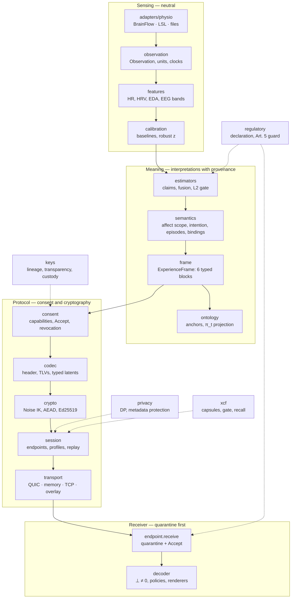

<!--
SPDX-FileCopyrightText: 2026 Vigilant e.K. and contributors
SPDX-License-Identifier: CC-BY-SA-4.0
-->

# Architecture

ESP separates **measuring**, **interpreting**, **representing**, **consenting**,
**transporting** and **decoding**. Each layer has its own module and its own trust boundary.

## Trust boundaries

1. **Device to features.** Raw samples never leave the sender unless a profile explicitly allows
   it. Features carry quality scores and provenance.
2. **Interpretation to frame.** Every affect statement carries an `affect_scope`. Subject-side
   inference needs L2, consent and a regulatory declaration.
3. **Sender to wire.** Only the intersection of the sender capability, the receiver capability
   and the session profile is encoded. Withheld objects are absent, not hidden.
4. **Wire to receiver.** Authenticity, replay, size and a minimal parse come first. The 13-condition
   Accept predicate comes second. Decoding comes last.
5. **Receiver to application.** Decoders declare absence policies. The transparency panel shows
   what cannot be reconstructed.

## Module map

| Package | Responsibility | Key types |
|---|---|---|
| `esp.core` | IDs, clocks, provenance, error register, canonical JSON | `EspModel`, `ClockStamp`, `ErrorCode` |
| `esp.frame` | experience frames, disclosure, minimization | `ExperienceFrame`, `TypeBlock`, `DisclosurePolicy` |
| `esp.codec` | 100-byte header, TLVs, typed latents, frame wire | `Header`, `Tlv`, `frame_to_payload` |
| `esp.crypto` | Noise IK, envelope, keys, identity, provenance | `NoiseIK`, `seal_packet`, `DirectionKeys` |
| `esp.consent` | capabilities, Accept predicate, revocation | `SenderCapability`, `evaluate`, `RevocationIntent` |
| `esp.session` | endpoints, descriptors, profiles, replay, floor | `SenderEndpoint`, `ReceiverEndpoint` |
| `esp.transport` | channels and transports | `Connection`, `QuicConnection`, `memory_link` |
| `esp.privacy` | runtime DP, metadata protection | `DpConfig`, `MetadataProtection` |
| `esp.keys` | lineage, transparency log, custody | `KeyLineage`, `TransparencyLog` |
| `esp.decoder` | absence handling, compatibility, renderers | `run_decoder`, `transparency_panel` |
| `esp.regulatory` | declaration and guard | `RegulatoryDeclaration`, `require_permitted` |
| `esp.xcf` | capsules, gate, recall, trust vector | `seal`, `Gate`, `recall`, `TrustScore` |
| `esp.audit`, `esp.bench`, `esp.training` | leakage audits, benchmarks, encoder training | `leakage_matrix`, `run_all`, `Trainer` |
