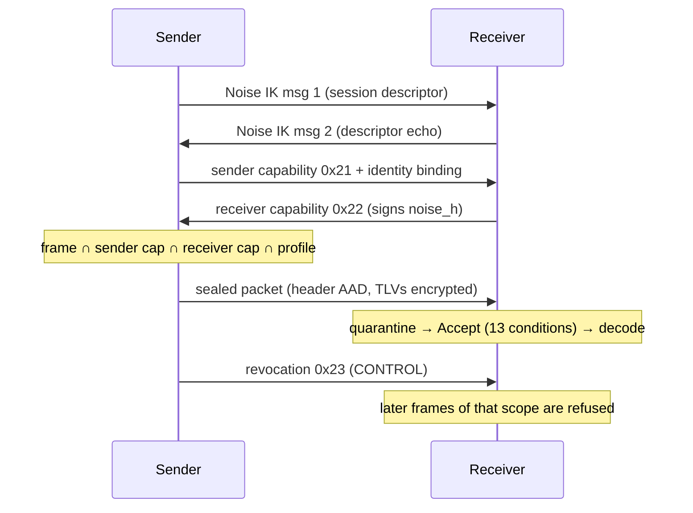

<!--
SPDX-FileCopyrightText: 2026 Vigilant e.K. and contributors
SPDX-License-Identifier: CC-BY-SA-4.0
-->

# Protocol walkthrough

This guide follows one frame from the sender to the receiver. Every code block runs as part of
the test suite (`tests/unit/test_docs_examples.py`).

## 1. One complete exchange in-process

`esp.demo.ui.run_exchange` performs a real Noise IK handshake. It then exchanges capabilities
and sends one sealed packet. It returns what the wire and the receiver saw.

```python
from esp.demo.ui import run_exchange

result = run_exchange({
    "emotions": {"fear": 4}, "valence": 1, "arousal": 4, "avoid": 5,
    "context": "work", "knowledge": "possible_dismissal",
    "sender_types": ["KNO", "INT", "EMO", "CTX"],
    "receiver_types": ["KNO", "INT", "EMO", "CTX"],
    "share_binding": True,
})
assert result["ok"]
print(result["wire"]["header"])  # the only part an observer can read
print(result["decrypted_tlv"])   # what the receiver decrypted
assert result["wire"]["packet_bytes"] == 180 + result["wire"]["header"]["payload_len"]
```

## 2. The packet on the wire

Every packet has this layout:

```
header (100 B, AAD) ‖ ciphertext (payload_len) ‖ Poly1305 tag (16 B) ‖ Ed25519 signature (64 B)
```

The golden vector `vectors/crypto/packet_valid.json` pins every byte of it:

```python
import json, uuid
from pathlib import Path
from esp.codec.header import HEADER_LEN, Header
from esp.crypto.envelope import open_packet
from esp.crypto.keys import DirectionKeys

vector = json.loads(Path("vectors/crypto/packet_valid.json").read_text())["vectors"][0]
packet = bytes.fromhex(vector["packet_hex"])
header = Header.decode(packet[:HEADER_LEN])
assert HEADER_LEN == 100 and len(packet) == header.packet_len
assert header.timeline_id == uuid.UUID(vector["timeline_id"])
assert header.segment_seq == int(vector["segment_seq"])

keys = DirectionKeys.from_split_key(bytes.fromhex(vector["k_split"]))
opened = open_packet(packet, keys, expected_sender=header.sender_id, max_payload_len=1 << 16)
assert opened.plaintext == bytes.fromhex(vector["plaintext"])
```

The nonce is derived deterministically (errata E-01), so a retransmission is byte-identical.

## 3. The sequence of steps


